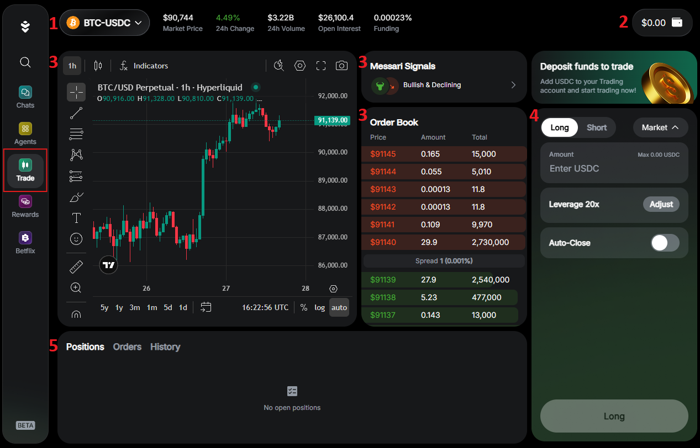
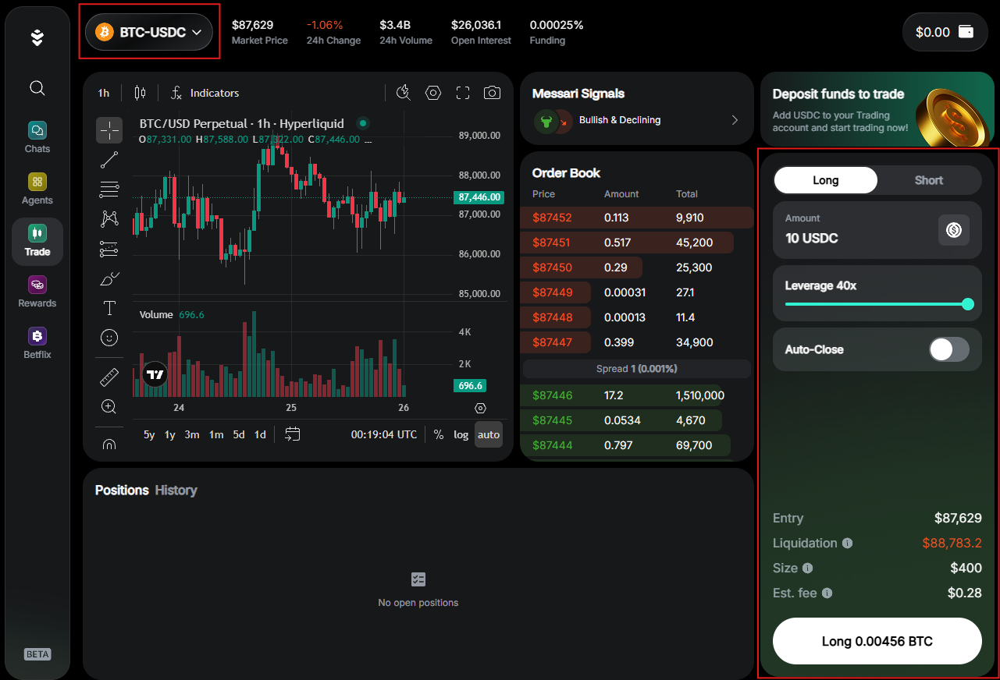
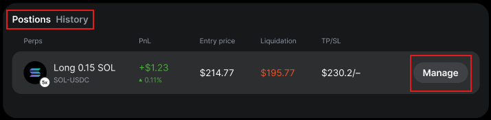
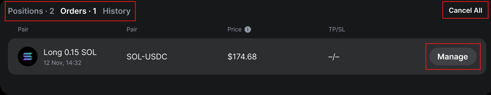
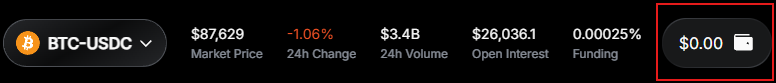
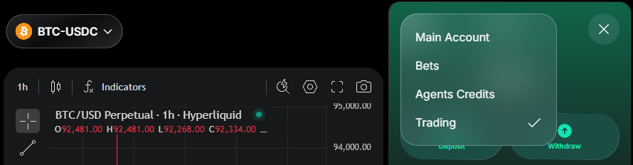
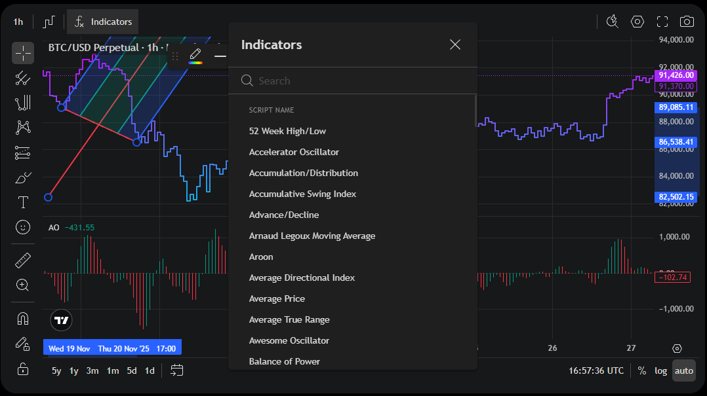

---
sidebar_position: 7
---

# Trade

## Overview

In Warden, you can use **perpetual contracts** (**trade perps**) to trade on future price movements of underlying token without actually owning them. At the moment, Warden supports [Hyperliquid](https://hyperfoundation.org) perps.

Warden's **AI Trading Terminal** brings real-time market analysis tools directly into your trading screen so you make informed decisions before placing a trade. This includes AI signals, an order book, and a chart with technical indicators and drawing tools.

This guide explains how to open and manage your positions, manage the trading wallet, and use market analysis tools. To learn more about perps and the related concepts, see [Perpetual trading](#perpetual-trading).

:::warning
Perpetual Trading involves significant risk, including potential loss of all funds due to leverage and volatility, and may not suit all users.
:::

:::tip
Want to trade just for fun? Try [Betflix](play-betflix).
:::

## Access the Trading Terminal

**AI Trading Terminal** is a place in Warden where you can open perpetual trading positions and analyze market data. To access the Terminal, do this:

1. Log in: 👉 [Warden](https://app.wardenprotocol.org)
2. Open the **Trade** tab.

You'll see the Terminal interface, where you can do the following:

1. Select a perp to trade
2. [Manage the trading wallet](#manage-the-trading-wallet)
3. [Analyze the market](#analyze-the-market)
4. [Create an order](#2-create-an-order)
5. [Manage your trade](#3-manage-your-trade)

## Manage trades

### 1. Prepare funds

To start trading, you need **USDC** on **Ethereum**, **Arbitrum**, **Base**, or **BSC** (**$5** or more):

1. Log in: 👉 [Warden](https://app.wardenprotocol.org)
2. If you don't have USDC, [deposit it to your main wallet](manage-assets#deposit-assets).
3. In the left menu, open the **Trade** tab to [access the AI Trading Terminal](#access-the-trading-terminal).
4. Click the wallet icon at the top right to open the [trading wallet](#manage-the-trading-wallet).
5. In the trading wallet, click **Deposit** and add USDC from your main wallet.

### 2. Create an order

An **order** is an instruction for opening a [position](#position) (participating in a perpetual contract). Warden supports both [market](#market-order) and [limit orders](#limit-order).

Once you have funds in your trading wallet, you can create an order. [Open the AI Trading Terminal](#access-the-trading-terminal) and do this:

1. If it's your first trade, click **Start Trading** and confirm your consent.
2. Select a token pair from the drop-down menu at the top left.
3. In the configuration panel at the right, set your [order parameters](#order-parameters).
4. Click **Long**/**Short** at the bottom of the configuration panel.
5. Review your order details and confirm opening a position.

:::note Notes
- Tokens are always paired with **USDC**. Selecting a pair determines the perp you'll trade.
- Before selecting a perp, you can [analyze the market](#analyze-the-market).
- Opening a position is subject to [trade fees](fees#trade-fees).
:::

### 3. Manage your trade

After you [create an order](#2-create-an-order), the following will happen:
- A market order will open a position immediately at the best available perp price.
- A limit order will open a position only when the perp price reaches your target price.

:::note
Long orders execute at the target price or lower, shorts execute at the target price or higher.
:::

In the [AI Trading Terminal](#access-the-trading-terminal), you can track and manage your positions and pending limit order. See the tabs in the bottom panel:

- **Positions**: Access your open positions.
- **Orders**: Access your pending limit orders.
- **History**: View your closed positions.

To manage an open position or a limit order, click the **Manage** button next to it. You can do the following:

- Enable or disable **Auto-Close**, setting **Take Profit** and **Stop Loss** if needed. 
- To close your position or cancel order, click **Close**/**Cancel Order** and confirm. You'll see the closed position in the **History** tab.
- To cancel all orders, click **Cancel All** in the **Orders** tab.

:::note
Next to each position, you can see its [liquidation price](#liquidation). You can avoid liquidation by enabling [Auto-Close](#order-parameters).
:::

### Order parameters

When [creating an order](#2-create-an-order), you can set the following parameters in the configuration panel:

- **Long**/**Short**: A setting indicating whether your position will benefit when the [spot price](#spot-price) moves up (long) or down (short).
- **Order Type**:
  - **Market**: Orders that open positions immediately at the best available perp price.
  - **Limit**: Orders that open positions at a price you set (or better).
- **Price**: The price at which you wish to open your position. Long orders execute at the target price or lower, shorts execute at the target price or higher. This option is available only for limit orders. 
- **Amount**: The token amount to trade, set in USDC. This will become your security deposit, or [margin](#margin).
- **Leverage**: Your [leverage](#leverage)—a multiplier defining how strongly the token's price movements affect your gains and losses. It can be **2–40x** depending on the token.
- **Auto-Close**: Automatically close your position when the market price reaches the thresholds you set:
    - **Take Profit**: The upper price where your position closes to secure profit.
    - **Stop Loss**: The lower price where your position closes to cut losses. This helps prevent [liquidation](#liquidation).

:::note
You can adjust **Auto-Close** even after creating an order. See [Manage your trade](#3-manage-your-trade).
:::

There are also additional parameters that are automatically calculated based on your settings:

- **Entry**: The estimated price at which your position will open if executed now, based on the current market conditions.
- **Liquidation price**: The price at which your position will automatically close to prevent further losses.
- **Size**: The total value of your position, determined by your margin and leverage.
- **Est. fee**: The total fee charged for opening a position. See [trade fees](fees#trade-fees).

## Manage the trading wallet

Your perpetual trading balance is kept in **USDC** within a separate **trading wallet**. This protects assets in the [main Warden wallet](manage-your-wallet) from being liquidated.

To switch between the main and trading wallets at any time, click the wallet icon at the top right and select **Main Account** or **Trading**. When you're in the **Trade** tab, the trading wallet is selected automatically.

This is how to move funds between your wallets:

- To deposit USDC from the main wallet (starting from **$6**), click **Deposit**.
- To withdraw USDC to the main wallet (starting from **$5**), click **Withdraw**.

:::tip
You can deposit **USDC** from the following chains:

- **Ethereum**
- **Arbitrum**
- **Base**
- **BNB Smart Chain (BSC**)
:::

:::note
When depositing, you see your consolidated balance across all supported chains.
:::

## Analyze the market

In the [AI Trading Terminal](#access-the-trading-terminal), you can access various market analysis tools helping you make informed decisions on your trades:

- **The live chart** displays perp price movements. It supports multiple chart types, technical indicators, drawing tools, and more.
- **The order book** shows real-time perp market liquidity. The market data for the chart and order book is provided by [Hyperliquid](https://hyperfoundation.org).
- **Messari Signals** powered by [Messari](https://messari.io) are AI-generated token reports. For deeper insights, use the  [Messari Deep Research](explore-ai-agents#messari-deep-research) Agent.

## Perpetual trading

#### Trade perp

A **trade perp** (**perpetual contract**) is a never-expiring derivative that tracks the [spot price](#spot-price) of a specific token. Such contracts allow you to do the following:

- Trade on future price movements without owning the underlying tokens
- Maintain your [positions](#position) for as long as you meet the required [margin](#margin)

#### Position

A **position** is your participation (exposure) in a [perp](#trade-perp). If you take a **long** position, that means you expect the token's [spot price](#spot-price) to increase and will profit from it. **Short** positions profit when the price moves down.

#### Market order

A **market order** is an instruction to open a [position](#position) in a [perp](#trade-perp) immediately at the best available perp price.

#### Limit order

A **limit order** is an instruction to open a [position](#position) in a [perp](#trade-perp) when its price reaches your preferred price or better:

- Long orders execute at the target price or lower.
- Short orders execute at the target price or higher.

#### Spot price

**Spot price** is the current market price at which a token can be immediately bought or sold.

#### Margin

**Margin** is the security deposit that keeps your [positions](#position) open. If your margin drops too low because the position is losing money, a [liquidation](#liquidation) will happen: Warden will automatically close the position.

#### Leverage

**Leverage** is a tool that lets you control a larger [position](#position) than the amount of money you commit as [margin](#margin). This magnifies the impact of price changes on your margin. For example, with a 5x leverage, a 1% price move feels like a 5% move on your position.

:::warning
Trading with leverage amplifies gains and losses, increasing the risk of [liquidation](#liquidation).
:::

#### Funding rates

**Funding rates** are small payments that keep the [perp](#trade-perp) price close to the token's [spot price](#spot-price). When the perp price drifts away from the spot price, [long and short](#position) traders pay each other:

- When the perp price is above the spot price, longs pay shorts.
- When the perp price is below the spot price, shorts pay longs.

:::note
No action is needed: Warden handles these payments automatically.
:::

#### Liquidation

**Liquidation** happens when losses on your [leveraged position](#leverage) reduce your [margin](#margin) to the point where it can no longer cover the risk. To prevent your balance from going negative, Warden automatically closes your position and finalizes the loss.
