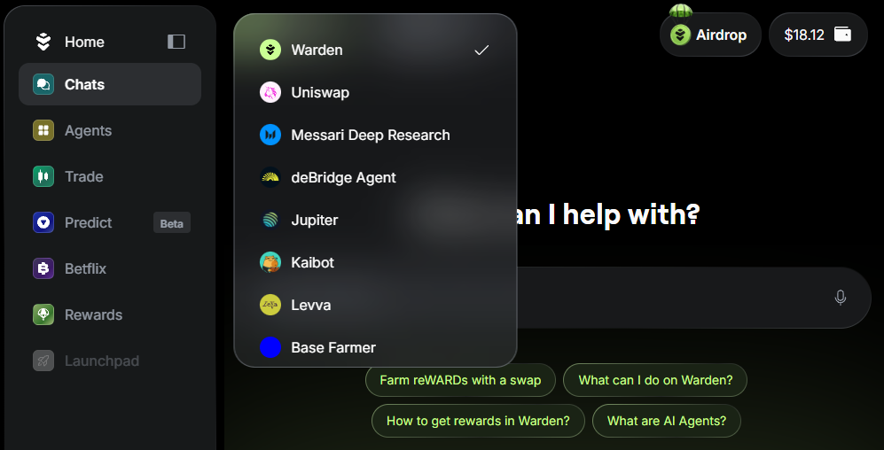

---
sidebar_position: 3
---

# Use the chat

## Overview

The **AI-powered chat** is the primary way to interact with Warden.

Use simple chat commands to send and swap your assets, check your balance, and ask anything about the app, Warden Protocol, or the crypto market.

You can either start chatting with the default **Warden AMA Agent** or choose another available [AI Agent](explore-ai-agents).

## Start chatting

Once you log in to [Warden](https://app.wardenprotocol.org), you'll see a chat with the AI-powered [Warden AMA Agent](explore-ai-agents#warden-ama-agent). 

To start interacting, just type your request in the chat box. For example, to perform a transaction, [fund your wallet](manage-assets#deposit-assets) and ask Warden to [send or swap an asset](manage-assets#send-or-swap-assets):

## Manage chats

You can easily manage your chats:

- To create more chats, click **New chat** in the top-left corner on the screen.
- To return to a previously created conversation, click the chat icon next to **New Chat**.

## Select an AI Agent

In addition to the Warden AMA Agent, you can interact with [other AI Agents](explore-ai-agents#uniswap-trading-api) available in the app.

Explore Agents in the [Agent Hub](explore-ai-agents#access-agents) or switch between them directly using the drop-down menu at the top:

## Explore the dashboard

Below the chat, you can find a useful **dashboard** with prompt suggestions, an overview of your assets, and more:

