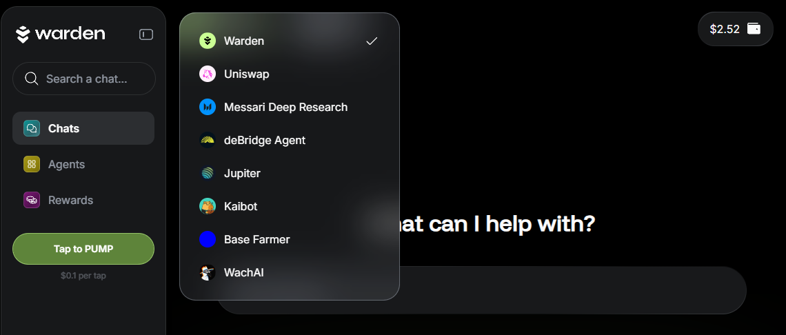
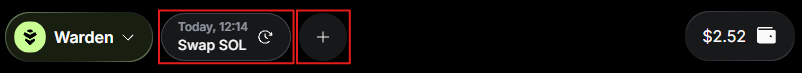
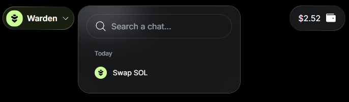
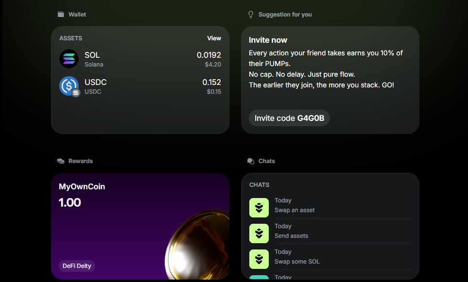

# Use the AI chat

## Overview

The **AI-powered chat** is the main way to interact with Warden.

Use simple commands to send and swap your assets, check your balance, or ask questions about the app, Warden Protocol, and the crypto market.

You can start chatting with the default **Warden Agent** or select another [AI Agent](explore-ai-agents), as described in the sections below.

## Start chatting

You can access Agent chats anytime by navigating to the **Chats** tab in the left menu:

When you log in to [Warden](https://app.wardenprotocol.org), a new conversation with the AI-powered [Warden Agent](explore-ai-agents#warden-agent) opens automatically.

To start interacting, just type your request in the chat box. For example, to perform a transaction, [fund your wallet](manage-assets#deposit-assets) and ask Warden to [send or swap an asset](manage-assets#send-or-swap-assets).

## Select an AI Agent

In addition to the Warden Agent, you can interact with [other AI Agents](explore-ai-agents#uniswap-trading-api) available in the app.

Explore Agents in the [Agent Hub](explore-ai-agents#access-agents) or switch between them directly in the **Chats** tab using the drop-down menu at the top:

## Manage chats

You can easily manage your chats using the buttons at the top of the screen:

- To create a new chat, click the **+** button.
- To open or delete a previous thread, use the history drop-down menu.

## Explore the dashboard

Below the chat, you can find a useful **dashboard** with prompt suggestions, an overview of your assets, and more:

