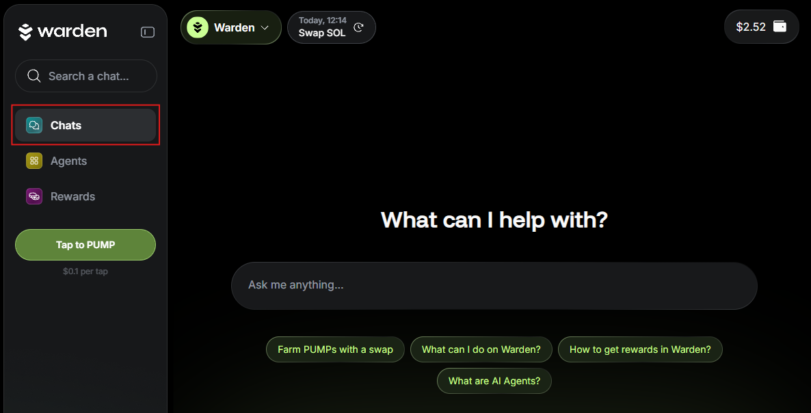

# Use the chat

## Overview

The **AI-powered chat** is the primary way to interact with the Warden App.

Use simple chat commands to send and swap your assets, check your balance, and ask anything about the app, Warden Protocol, or the crypto market.

You can either start chatting with the default **Warden AI assistant** or select one of the various available [AI Agents](use-ai-agents).

## Chat with Warden

Once you log in to the [Warden App](https://app.wardenprotocol.org), you'll see a chat with the **Warden AI assistant**.

Just type your request in the chat box. For example, to perform a transaction, [fund your wallet](manage-assets#deposit-assets) and ask Warden to [send or swap an asset](manage-assets#send-or-swap-assets):

## Manage chats

You can easily manage your chats:

- To create more chats, click **New chat** in the top-left corner on the screen.
- To return to a previously created conversation, click the chat icon next to **New Chat**.

## Select an AI Agent

In addition to the Warden assistant, you can use the various **AI Agents** available in the app. Learn more: [Use AI Agents](use-ai-agents).

Explore Agents in the [Agent Hub](use-ai-agents#access-agents) or switch quickly between the Warden assistant and Agents directly from the chat screen. Simply select an Agent from the drop-down menu at the top:

## Explore the dashboard

Below the chat, you can find a useful **dashboard** with prompt suggestions, an overview of your assets, and more:

