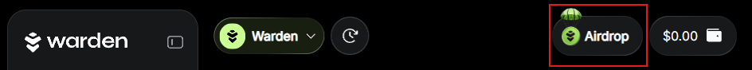
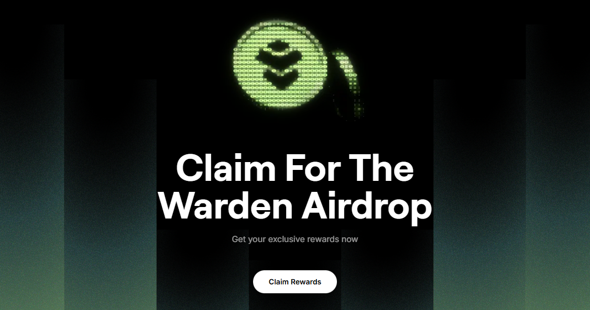
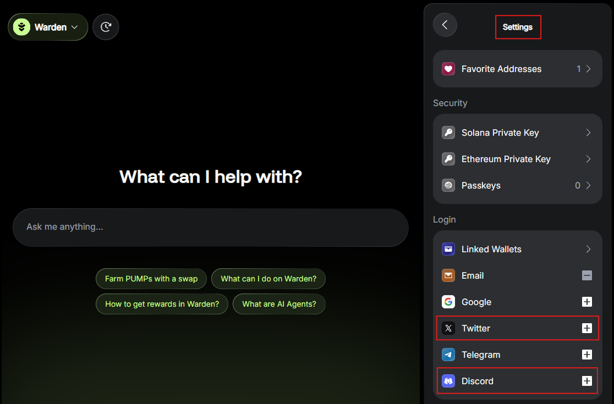
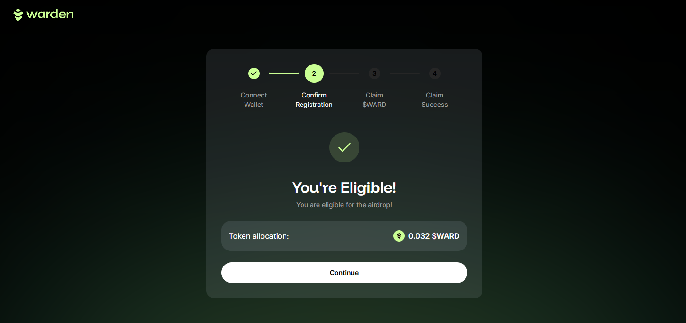
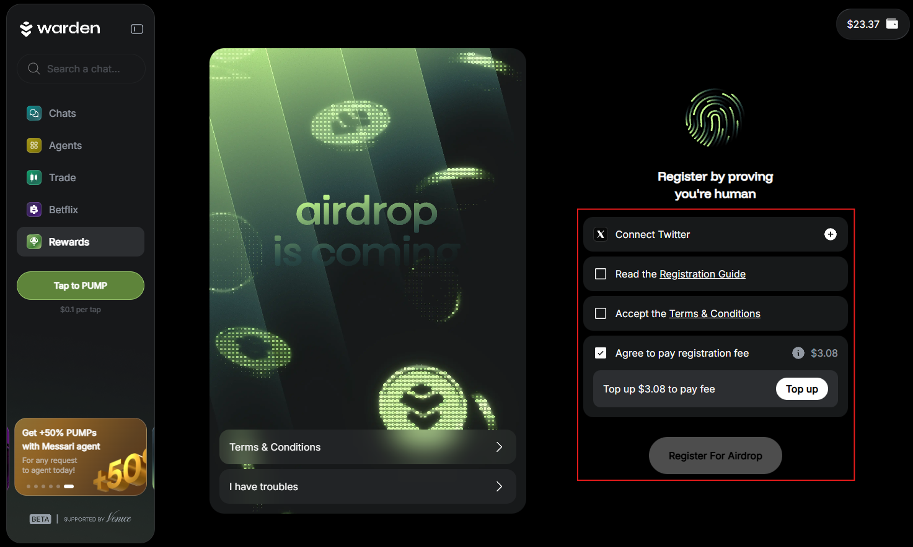

# $WARD airdrop

:::important
**Registration for the airdrop is now closed. If you're eligible, you can claim your $WARD or will receive it automatically.**

For those who registered but didn't meet the final [eligibility](#eligibility--distribution) threshold: the [registration fee](fees#airdrop-registration-fee) refunds will be processed in stablecoins to your Warden account over the coming weeks.
:::

:::warning
Make sure that you access the Airdrop Claim Portal through [Warden](https://app.wardenprotocol.org) or directly on [https://airdrop.wardenprotocol.org](https://airdrop.wardenprotocol.org). Do not click any external or social links. 
:::

## Overview

[$WARD](https://docs.wardenprotocol.org/ward/introduction), the token powering our Agentic economy, is now live and available for trading. 

Registration for the **$WARD airdrop** has ended. Registered users who are eligible can either [claim their $WARD](#claim-ward-on-warden) or receive it [automatically](#receive-ward-automatically). To find out whether you need to claim your reward or not, see [Eligibility & distribution](#eligibility--distribution).

Your airdrop will be available on [Warden Protocol](https://docs.wardenprotocol.org/learn/introduction-to-warden).

:::important Important notes
- All registration happened in [Warden](https://app.wardenprotocol.org), and claiming is available on the [Airdrop Claim Portal](https://airdrop.wardenprotocol.org). We'll **never** ask you to connect your wallet to any third-party website.
- To claim $WARD, you must have an active [Warden account](manage-your-wallets#main-account).
- Users who are not registered cannot participate in the claiming phase.
- Registration did not guarantee rewards. Only [eligible users](#eligibility--distribution) can claim $WARD.
:::

## Claim $WARD on Warden

To find out whether you need to claim your reward or not, see [Eligibility & distribution](#eligibility--distribution). This is how **claim-based distribution** works:

- You can choose when to claim. This is a one-time opportunity.
- The longer you wait, the larger your claim amount is.
- You'll reach the maximum allocation **after 6 months**.
- Claiming later also increases your Allocation Power, giving you priority access to future airdrops and priority positioning on the upcoming Agent Launchpad.

You can claim your $WARD in the **Airdrop Claim Portal**:

:::important
Before you proceed, make sure you understand how claim-based distribution works. You may choose to claim later and earn more.
:::

1. In [Warden](https://app.wardenprotocol.org), click the **Airdrop** icon at the top-right. You'll be redirected to the portal. Alternatively, you can access it directly: 👉 [https://airdrop.wardenprotocol.org](https://airdrop.wardenprotocol.org)
2. Click **Claim Rewards**.
3. Connect your [Warden account](manage-your-wallets#main-account). Use the same credentials with which you log in to Warden.
4. Click **Continue**. This option is displayed only if you're eligible.
5. Click **Claim** and confirm.
6. Review and accept the terms.
7. Wait for the claim. Once complete, you'll see a success message.

Once you claim your $WARD, the following happens:
- Your reward is locked.
- Any unclaimed remainder is returned to the Public Goods pool, fueling future community campaigns and rewards.
- You can [stake your $WARD](stake-ward).

:::warning
Make sure that you access the Airdrop Claim Portal through [Warden](https://app.wardenprotocol.org) or directly on [https://airdrop.wardenprotocol.org](https://airdrop.wardenprotocol.org). Do not click any external or social links. 
:::

## Receive $WARD automatically

To find out whether you need to claim your reward or not, see [Eligibility & distribution](#eligibility--distribution).

If you're eligible for **automatic distribution**, you'll receive your full allocations directly to your [Warden account](manage-your-wallets#main-account) during the first week after trading opens. We'll announce the exact timing via our official channels.

After getting your $WARD, you can [stake it](stake-ward).

## Eligibility & distribution

This section describes the **eligibility criteria** and **distribution type**, depending on the user type.

Eligibility criteria included airdrop registration and preparatory steps in your Warden account. These steps were required before registration closed, and new users **can no longer register**.

:::tip
You may be eligible for multiple campaigns at once.
:::

:::important
For those who registered but didn't meet the final eligibility threshold: the [registration fee](fees#airdrop-registration-fee) refunds will be processed in stablecoins to your Warden account over the coming weeks.
:::

### Warden users

- **Eligibility criteria**: Registration (no additional action required).
- **Distribution mechanism**: [claim-based](#claim-ward-on-warden).

### Kaito yappers

- **Eligibility criteria**:
  - Participate in the Kaito Pre-TGE campaign
  - Link your X account to your Warden account
  - Register for the airdrop
- **Distribution mechanism**: [claim-based](#claim-ward-on-warden).

:::note
We tracked the mindshare you had generated during the Kaito Pre-TGE campaign.
:::

### WARP holders & stakers

- **Eligibility criteria**:
  - Hold **WARP** or **staked WARP** on [YieldWard](https://yieldward.com)
  - Link your wallets containing these assets to your Warden account
  - Register for the airdrop
- **Distribution mechanism**: [automatic](#receive-ward-automatically).

### OPEN OG holders & stakers

- **Eligibility criteria**:
  - Hold the minimum required amount of **LVVA** or **staked LVVA** 
  - Hold the unique NFT on **Base**, owned by the same wallet address that held LVVA
  - Link your wallet containing these assets to your Warden account
  - Register for the airdrop
- **Distribution mechanism**: [automatic](#receive-ward-automatically).

### Pre-Early Subscription NFT holders

- **Eligibility criteria**:
  - Hold a valid [Pre-Early Subscription NFT](https://opensea.io/0xb48d6c39283777c9cf56c5327238688e4081cf1f/created) on **Base** ([Basic](https://opensea.io/collection/warden-pre-early-basic/overview), [Pro](https://opensea.io/collection/warden-pre-early-pro/overview), [Premium](https://opensea.io/collection/warden-pre-early-premium/overview), or [Infinite](https://opensea.io/collection/warden-pre-early-infinite/overview))
  - Hold the NFT in a wallet you controlled
  - Link that wallet to your Warden account before registration 
  - Register for the airdrop
- **Distribution mechanism**: [claim-based](#claim-ward-on-warden).  

:::note
When you claim your reward, your Pre-Early status, tier, and benefits are automatically detected based on the linked wallet.
::: 

### Ambassadors

- **Eligibility criteria**:
  - Link your X and Discord accounts
  - Register for the airdrop
- **Distribution mechanism**: [claim-based](#claim-ward-on-warden).

### Wallchain Quacks holders

- **Eligibility criteria**:
  - Hold **Wallchain Quacks**.
  - Link your X account to your Warden account
- **Distribution mechanism**: [automatic](#receive-ward-automatically) (through [Wallchain](https://www.wallchain.xyz)).

:::note
In this case, registration for the airdrop wasn't required.
:::

## Other ways to get $WARD

Besides the airdrop, you can **buy $WARD** using **external wallets**, outside of Warden.

Buying $WARD from CEXs & DEXs **does not require a Warden account**. You manage purchased $WARD entirely through your external wallet.

External wallets can interact with third-party apps for actions such as **swapping and bridging $WARD**.
