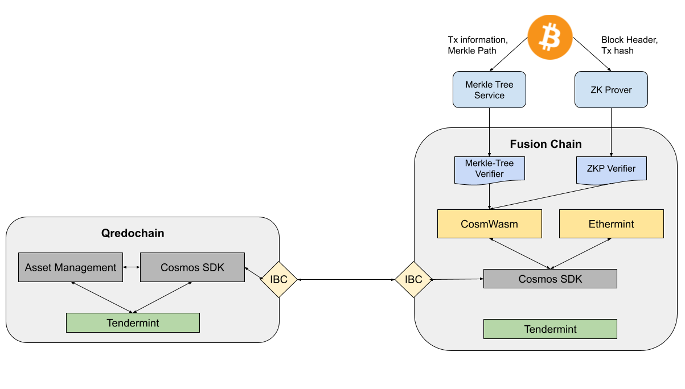

[comment]: # (This template is meant to be included in our PoCs' project repositories. It focuses on general- as well as technical information that should help the reader to get a better understanding of what this PoC aims to accomplish. Copy the markdwon below and paste it in your repo. Fill the text area with information related to the questions and please don't change the headlines)

# Fusion Chain 

# Table of Contents
1. [Status](#status)
2. [Introduction](#introduction)
    1. [Summary](#summary)
    2. [Motivation](#motivation)
    3. [Commercial Use Case](#commercial-use-case)
3. [Technical Overview](#technical-overview)
    1. [Solution Architecture](#solution-architecture)
    2. [Dependencies](#dependencies)
    3. [Security Considerations](#security-considerations)
4. [Acceptance Criteria](#acceptance-criteria)
5. [Learnings and Citations](#learnings-and-citations)
    1. [Learnings](#learnings)
    2. [Citations](#citations)

## Status

Active

[Back top](#table-of-contents)

## Header

Name: Fusion Chain - L1 Watcher and Agregator

Proposer: n/a

Engineer Owner: Sasha Duke

Status: In progress

Proposal date: 01.07.2022

[Back top](#table-of-contents)

## Introduction

### Summary

The Fusion Chain Proof of Concept aims to demonstrate watcher capabilities on a sovereign Cosmos SDK chain with the unique characteristic of having the CosmWasm and Ethermint module integrated that allows to write smart contracts that are EVM, or Wasm-compatible, respectively. 

In this PoC, we are focusing on the BTC watcher. Therefore, we implement two verifier applications that on the one hand prove that a transaction is included in a given block and on the other hand that the transaction has actually been executed. Results from the watcher can then be further processed either directly on the Fusion Chain or sent to the Qredochain via IBC. 

Architecture of the Fusion Chain with two verifier contracts deployed and the IBC interface to the Qredochain via the Cosmos SDK:

[Back top](#table-of-contents)

### Motivation

The Cosmos SDK itself is a very powerful tool. It also runs on Tendermint, like the existing Qredochain, but comes with an application-specific architecture and a lot of already existing modules that could bring great benefit to the Qredo ecosystem. With the support of CosmWasm and Etheremint, the Fusion Chain comes with multi-language support which is attractive for a wider developer community as well as provides the infrastructure to integrate other Qredo products and services like QSign smart contracts. Therefore, the Fusion Chain is of great importance for Qredo products and the QRDO coin.

However, the focus on this PoC is rebuilding the watcher and provide an attractive blockchain for third party developers, as the Fusion Chain will be open-sourced once we have a stable version. In the long term, it is possible to add and transfer logic from the Qredochain to the Fusion Chain, including the QRDO token with extended functionality like native staking and native governance. 

[Back top](#table-of-contents)

### Commercial Use Case

The Fusion Chain will be the new main blockchain of the Qredo ecosystem and much more outwards-facing than the existing Qredochain. We aim to provide Qredo products such as keyless wallets with MPC computation or QSign logic. Apart from the products we will offer the possibility to develop CosmWasm and Solidty smart contracts which is attractive as it combines the best of both worlds - the EVM and the Cosmos SDK. 

Perspectively, this will put the Fusion Chain in a position to transfer logic and responsibilities from the Qredochain to the Fusion Chain. This could be happening through Interchain Accounts via IBC or with the a transfer of the logic.

[Back top](#table-of-contents)

## Technical Overview

The Fusion Chain is built with the Cosmos SDK on top of the Tendermint consensus engine. The Cosmos SDK is an application-specific blockchain enabled by modules. The modules inside the Cosmos SDK consist of sets of standard functionalities dedicated to a specific purpose. There are standard sets of modules for instance the staking module or the governance module which are required if you want to launch a public permissionless Proof of Stake blockchain with the Cosmos SDK. However, it is not mandatory to use any of these modules and you can only integrate what your blockchain or product really needs which makes the blockchain fast, efficient, and less crowded. Any module can be added to a Cosmos SDK chain without adjusting the existing logic of other modules.

In this PoC we are integrating the following three modules: 

1. CosmWasm: CosmWasm is a new smart contracting platform built for the cosmos ecosystem on the premises of WASM to integrate it into their product. Particularly, it is aimed at Go developers with experience with the Cosmos SDK, as well as Rust developers looking for a blockchain platform.
2. Ethermint: Ethermint is an implementation of the EVM, built using the Cosmos SDK. The software enables users to deploy any EVM-compatible code in solidity and immediately enjoy PoS consensus and instant finality with little to no overhead. In this way, Ethermint is a fully integrated part of the Cosmos ecosystem but is also fully compatible with the EVM.
3. IBC: Perspectively, the Inter-Blockchain Communication protocol (IBC) will be integrated to the Fusion chain as well. It allows independent blockchains to connect and flourish, transfer tokens and other data, and enrich their ecosystems through every interaction. In Qredo's case we aim to use IBC for exchanging messages between the Qredochain and Fusion Chain as well as Fusion Chain and other IBC-enabled Cosmos SDK chains in the wild.

For the watcher functionality, we are introducing two types of verifiers that will use Merkle- and Zero Knowledge Proofs to ensure the integrity and constistency of assets from other L1s on the Qredo blockchain ecosystem. 

Want to know more about the components what we are talking about? Go check-out our [wiki](../overview/tech-wiki.md)!

[Markle Proofs](../overview/tech-wiki.md#merkle-proofs)

[Zero Knowledge Proofs](../overview/tech-wiki.md#zero-knowledge-proof)

[ZK-STARKs](../overview/tech-wiki.md#zk-stark)

[Back top](#table-of-contents)

### Solution Architecture

The Fusion Chain allows implementing CosmWasm as well as Solidity smart contracts due to the CosmWasm and Ethermint module, respectively. This allows for a more rapid development process as the creation of new contracts can be submitted right away, whereas having this logic as a module often requires a network upgrade where the majority of the validators need to approve it. 

There are two verifier contracts written in CosmWasm on the Fusion Chain for this PoC. 

1. Merkle Proof Verifier: This contract verifies a provided proof that a transaction was included in a provided block. It receives the proof from an off-chain service that was given transaction information and the Merkle path of the respective transaction. 
2. ZKP Verifier: This contract verifies the actual execution of a provided transaction given the block header and a Zero Knowledge Proof from the ZKP prover that helps verifiying the respective transaction.

These two features combined result in new watcher functionalities that assure a provided transaction is valid and was executed correctly. The results of the new watcher service can either be processed within the Fusion Chain or forwarded to the Qredochain via the IBC protocol. 

Architecture of the Fusion Chain with two verifier contracts deployed and the IBC interface to the Qredochain:

[Back top](#table-of-contents)

### Dependencies

1. CosmWasm & Ethermint Module: Have to have this enabled in your Cosmos SDK chain
2. ZK libraries such as Cairo: Cairo is a programming language for writing provable programs, where one party can prove to another that a certain computation was executed correctly

[Back top](#table-of-contents)

### Security Considerations

[comment]: # (This paragraph should include any security considerations. Especially those that we did not implement in the PoC but need to be implemented once it becomes an actual feature/product of Qredo.)

Creating Zero Knowledge Proofs is a resource intensive calculation that might take a few seconds, depending on how large the input data is. This might result in longer processing time than the block time of a blockchain and could prevent validating transactions on the fly.

Our watcher is a complicated, vulnerable piece of software. Qredo has a single watcher, and it’s the only link between L1 and L2. An interruption to the watcher breaks this link. It’s a single point of failure, and a compromise means we can’t process deposits-& withdrawals anymore. Relayer contract fees are paid for by the wallets in the watcher. The funds are limited, topped-up on demand. Hacking the watcher exposes 10-12 ETH at risk.

[Back top](#table-of-contents)

## Acceptance Criteria

The acceptance criteria for this PoC are the following: 

1. Run a Cosmos SDK blockchain with CosmWasm and Ethermint module enabled
2. IBC is enabled and a connection to the Qredochain can be established
3. Implement a working Merkle Tree verifier of a BTC tx
4. Implement a working ZKP verifier of a BTC tx
5. Provide simple watcher and light client functionality of the counter blockchain

[Back top](#table-of-contents)

## Learnings and Citations

### Learnings

By beginning of 2023, CosmWasm seems to have issues when uploading CosmWasm contracts on ARM devices. When we tried to upload a CosmWasm contract it paniced and we had to switch to x86 machines who were able to successfully upload and run the contract. Once the team of Confio will continue working on CosmWasm, we will report the bug to the project.

[Back top](#table-of-contents)

### Citations

[comment]: # (If you want to cite relevant sources to help understand the PoC or put it in context, please use Harvard Style citations.)

[comment]: # (“Surname, Initial. - Year of publication - ‘Title of article’, Title of Journal, volume number - issue number - , page reference. If accessed online: Available at: DOI or URL - if required-  Accessed: date.”)

[Back top](#table-of-contents)